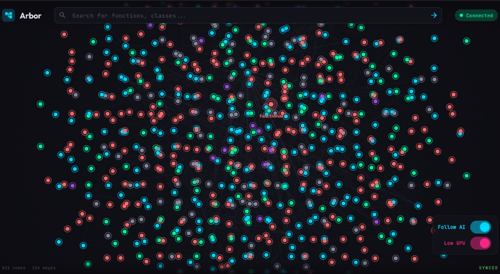

<p align="center">
  
</p>

<h1 align="center">Arbor v1.0.0</h1>

<p align="center">
  <strong>The Graph-Native Intelligence Layer for Code</strong><br>
  <em>Stop RAG-ing. Start navigating.</em>
</p>

<p align="center">
  <a href="#quick-start">Quick Start</a> •
  <a href="#why-arbor">Why Arbor?</a> •
  <a href="#features">Features</a> •
  <a href="#the-unified-nervous-system">Architecture</a> •
  <a href="docs/PROTOCOL.md">Protocol</a> •
  <a href="CONTRIBUTING.md">Contributing</a>
</p>

<p align="center">
  <a href="https://github.com/Anandb71/arbor/actions"></a>
  
  
  
  
  
  <a href="https://glama.ai/mcp/servers/Anandb71/arbor"></a>
</p>

---

## Why Arbor?

> **The Vector RAG Problem:** Most AI coding assistants treat your codebase like a bag of text. They embed chunks into vectors and hope similarity search finds the right context. The result? Hallucinated connections, missing dependencies, and refactors that break everything downstream.

**Arbor thinks differently.**

We parse your code into an Abstract Syntax Tree using [Tree-sitter](https://tree-sitter.github.io/), then build a living graph where every function, class, and variable is a **node**, and every import, call, and implementation is an **edge**. When an AI asks "where is authentication handled?", Arbor doesn't grep for "auth" — it traces the call graph to find the actual service that initiates the flow.

```
Traditional RAG:         Arbor:
                         
"auth" → 47 results      "auth" → AuthController
                                  ├── validates via → TokenMiddleware  
                                  ├── queries → UserRepository
                                  └── emits → AuthEvent
```

## Quick Start

### Option 1: Download Pre-built Binary (Recommended)

Download `arbor-windows-v1.0.0.zip` from the [Releases](https://github.com/Anandb71/arbor/releases) page.

```bash
# Unzip and add to PATH, then:
cd your-project
arbor init
arbor index
arbor bridge --viz   # Starts server + opens visualizer
```

### Option 2: Build from Source

```bash
# Clone and build
git clone https://github.com/Anandb71/arbor.git
cd arbor/crates
cargo build --release

# Build visualizer (requires Flutter)
cd ../visualizer
flutter build windows
```

That's it. Your IDE or AI agent can now connect to `ws://localhost:7433` and query the graph, or use the MCP protocol over stdio.

## Features

### 🧠 ArborQL & AI Bridge (MCP)

Arbor enables Claude and other LLMs to "walk" your code graph. Using the Model Context Protocol (MCP), agents can run:

- `find_path(start, end)`: Discover the logic flow between two distant components (A* algorithm).
- `analyze_impact(node)`: Determine the blast radius of a change before it happens.
- `get_context(node)`: Retrieve semantically relevant code, not just keyword matches.

### 🔗 World Edges (Cross-File Resolution)

Arbor understands that code doesn't live in isolation. It resolves **imports**, **calls**, and **inheritances** across file boundaries using a Global Symbol Table. It knows that `User` in `auth.ts` is the same as `User` imported in `profile.ts`.

### 💾 Incremental Persistence

Powered by **Sled**, Arbor's graph persistence layer is atomicity-compliant and lightning fast.

- **Granular Updates**: Only "dirty" nodes are re-written to disk. Saving a file in a 100k LOC repo triggers minimal I/O.
- **Instant Load**: The graph state loads instantly on startup, no re-indexing required.

### 🌲 Logic Forest Visualizer 2.0

The Flutter-based desktop app renders your codebase as a stunning Force-Directed Graph.

- **Cinematic Rendering**: Bloom, glow, and depth effects.
- **100k+ Node Support**: Optimized with Barnes-Hut QuadTrees and viewport culling.
- **Velocity LOD**: Dynamically simplifies rendering during rapid panning/zooming to maintain 60 FPS.
- **Interactive**: Drag nodes, hover for details, and watch the camera automatically follow AI context.



### ⚡ Performance

- **Sub-100ms Incremental Sync**: Parsing happens in milliseconds.
- **Binary Serialization**: Graph state uses efficient `bincode` encoding.
- **Rust Core**: Built on the safety and speed of Rust.

## Supported Languages

| Language   | Status | Parser Entity Coverage |
|------------|--------|------------------------|
| **Rust**       | ✅     | Functions, Structs, Impls, Traits, Macros |
| **TypeScript** | ✅     | Classes, Interfaces, Types, Imports, JSX |
| **JavaScript** | ✅     | Functions, Classes, Vars, Imports |
| **Python**     | ✅     | Classes, Functions, Imports, Decorators |
| **Go**         | ✅     | Structs, Interfaces, Funcs, Methods |
| **Java**       | ✅     | Classes, Interfaces, Methods, Fields, Connectors |
| **C**          | ✅     | Structs, Functions, Enums, Typedefs |
| **C++**        | ✅     | Classes, Namespaces, Templates, Impls |
| **C#**         | ✅     | Classes, Methods, Properties, Interfaces, Structs |
| **Dart**       | ✅     | Classes, Mixins, Methods, Widgets |

## Project Structure

```
arbor/
├── crates/                 # Rust workspace
│   ├── arbor-core/         # AST parsing, Tree-sitter integration
│   ├── arbor-graph/        # Graph schema, Sled Store, Symbol Table
│   ├── arbor-watcher/      # File watching, incremental sync
│   ├── arbor-server/       # WebSocket server, protocol handler
│   ├── arbor-mcp/          # Model Context Protocol bridge
│   └── arbor-cli/          # Command-line interface (pkg: arbor-graph-cli)
├── visualizer/             # Flutter desktop app
│   ├── lib/
│   │   ├── core/           # Theme, state management
│   │   ├── graph/          # Force-directed layout, LOD logic
│   │   └── shaders/        # GLSL bloom/glow effects
│   └── shaders/            # Raw GLSL files
└── docs/                   # Extended documentation
```

## Roadmap (v1.0.0 Completed)

- [x] **Phase 1**: Core indexer and CLI
- [x] **Phase 2**: Logic Forest visualizer (LOD, Bloom)
- [x] **Phase 3**: VS Code extension
- [x] **Phase 4**: Agentic Bridge (MCP)
- [x] **Phase 5**: Linux ARM64/AMD64 + macOS ARM64 CI/CD
- [x] **Phase 6**: Language server protocol support
- [x] **Phase 7**: Go and Java parser support
- [x] **Phase 8**: C/C++ parser support
- [x] **Phase 9**: Dart/Flutter parser support
- [x] **Phase 10**: The Brain Upgrade (Control Flow & Data Flow)
- [x] **Phase 11**: Expanded Support (C# Parser, Graph Persistence)

### Coming in v1.1.0 "The Sentinel Update"

- [ ] **Impact Radius Simulator**: Predict breakage before changes (heat gradient visualization)
- [ ] **Dynamic Context Slicing**: Token-optimized LLM context with node pinning
- [ ] **Shadow Indexing**: Structural git diffs (`--structural-only` flag)
- [ ] **Technical Debt Heatmaps**: Cyclomatic complexity, coupling, cohesion overlays
- [ ] **Arbor Relay**: Real-time collaborative graph sessions
- [ ] **Docker Distribution**: `docker pull ghcr.io/anandb71/arbor`
- [ ] **Cross-Platform Binaries**: macOS, Linux, Windows via GitHub Actions

📖 **Full roadmap**: [docs/ROADMAP.md](docs/ROADMAP.md)

## Security

Arbor is designed with a **Local-First** security model:

- **No data exfiltration**: All indexing and querying happens 100% locally. No code leaves your machine.
- **No API keys required**: Works entirely offline.
- **No telemetry**: Zero phone-home behavior.
- **Open source**: Full source code available for audit.

## The Unified Nervous System

Arbor v1.0.0 represents the complete "Nervous System" for your code:

```
     Claude asks about AuthController
           │
           ▼
    ┌─────────────────┐
    │   Arbor Bridge  │  ← MCP Server (ArborQL)
    │   (arbor-mcp)   │     "find_path(Auth, DB)"
    └────────┬────────┘
             │ trigger_spotlight()
             ▼
    ┌─────────────────┐
    │   SyncServer    │  ← WebSocket broadcast
    │   (port 8080)   │
    └────────┬────────┘
             │ FocusNode message
     ┌───────┴───────┐
     │               │
     ▼               ▼
┌─────────┐    ┌─────────┐
│ VS Code │    │  Forest │
│ Golden  │    │ Camera  │
│Highlight│    │Animation│
│ #FFD700 │    │ 600ms   │
└─────────┘    └─────────┘
```

## CLI Commands

| Command | Description |
|---------|-------------|
| `arbor init` | Creates `.arbor/` config directory |
| `arbor index` | Full index of the codebase |
| `arbor query <q>` | Search the graph |
| `arbor serve` | Start the sidecar server |
| `arbor export` | Export graph to JSON |
| `arbor status` | Show index status |
| `arbor viz` | Launch the Logic Forest visualizer |
| `arbor bridge` | Start MCP server for AI integration |
| `arbor bridge --viz` | MCP + Visualizer together |
| `arbor check-health` | System diagnostics and health check |

## License

MIT — use it however you want. See [LICENSE](LICENSE) for details.

---

<p align="center">
  <strong>Built for developers who think code is more than text.</strong>
</p>

<p align="center">
  <em>"The forest is mapped. The AI is walking the path."</em>
</p>

<p align="center">
  <a href="https://github.com/Anandb71/arbor">⭐ Star us on GitHub</a>
</p>
